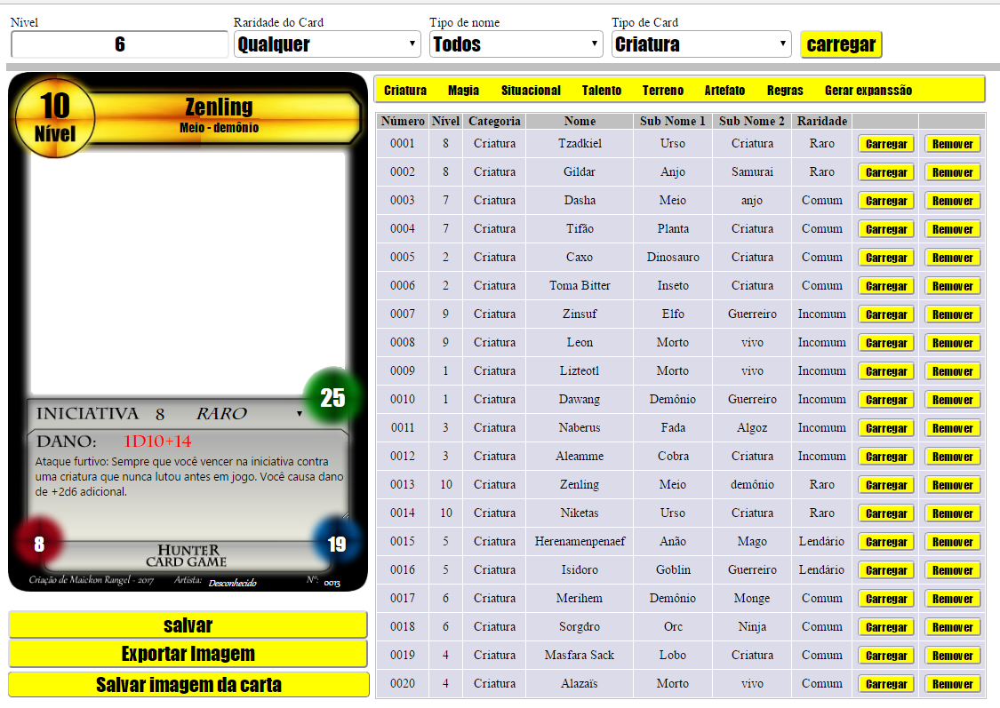
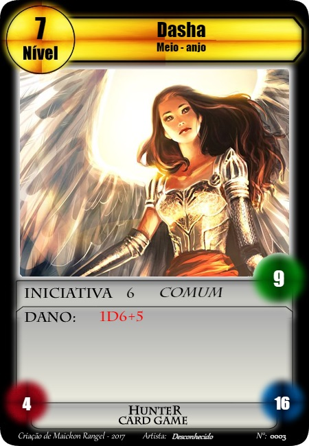
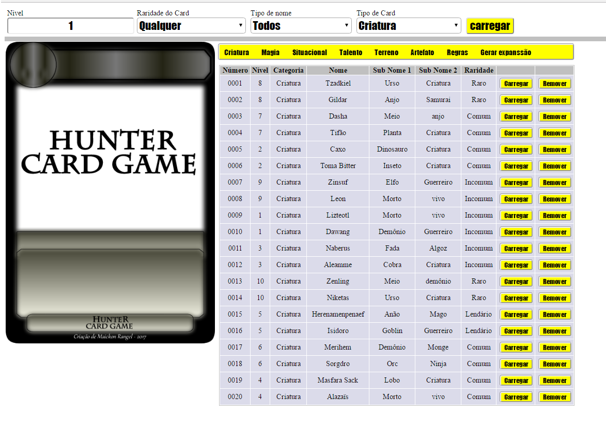
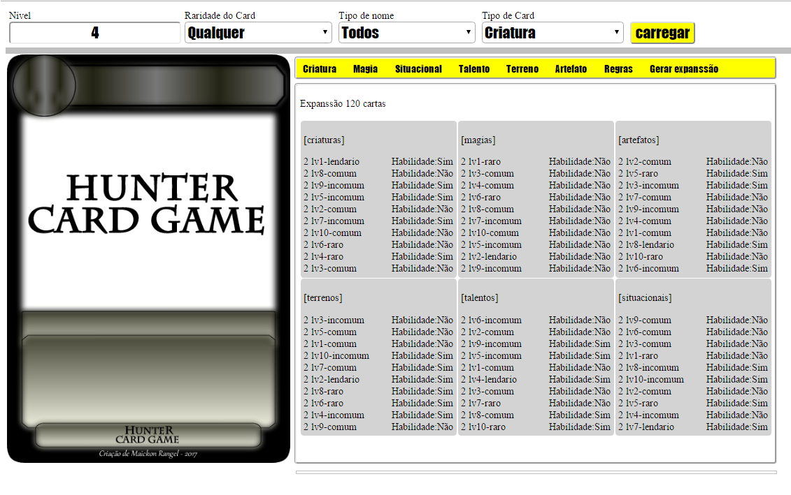

## Hunter Card Game

O Hunter Card Game é um jogo de cartas criado por Maickon Rangel. Na necessidade de se criar uma ferramenta que gerasse os templates das cartas para ajudar a criar as cartas do jogo, surgiu a idéia de se desenvolver este sistema.

O sistema apenas cria o modelo da carta com suas devidas descrições. Uma vez pronta, a carta pode ser salva na base de dados e posteriormente ser exportada para um arquivo de imagem do tipo .png.

A tela branca no centro da carta admite o ajuste de uma nova imagem por dentro da mesma. Este processo deve ser feito dentro de um software mais robusto capaz de redimensionar a imagem mantendo suas proporções para se enquadrar dentro da tela do card.

O exemplo abaixo mostra uma imagem recém ajustada num template gerado pelo programa.

Nas configurações durante a criação do card o usuário pode:

* Gerar um nome aleatório para o card a ser criador (Um brainstorming)
* Escolher o tipo de carta (Isso segue os padrões das regras do jogo)
* Salvar a carta criada
* Deletar a carta criada
* Editar a carta criada

Como pode ser visto nas imagens as cartas são separadas pelos seus tipos. Basta o usuário clicar no menu superior em amarelo para listar os tipos de cartas desejadas.

Além disso o sistema oferece uma opção de gerar uma coleção de cartas pré definida seguindo o padrão das regras de criação de card para o jogo conforme a imagem abaixo. 	

